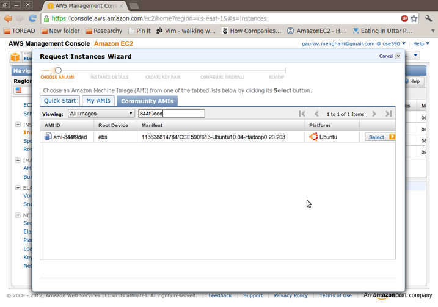
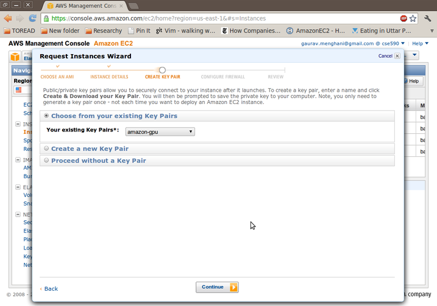
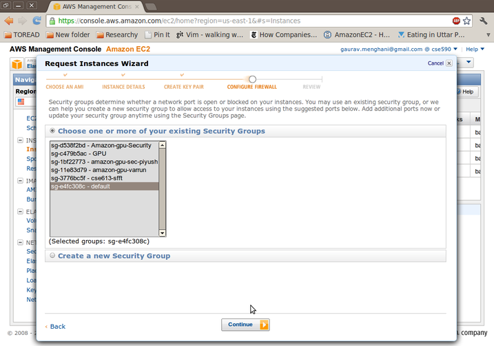
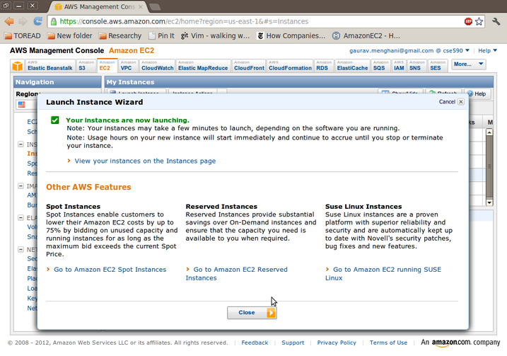

Using AWS for Hadoop
====================

---

# Creating the Instance

---

Creating the Instance
=====================
- In this tutorial, we will set up an instance from an Amazon Machine Image (AMI) that I have created. 

- If you want to set up an instance on your own, you have to:
- Select 'Launch Instance' in the AWS console and select 'Classic Wizard'
- Select 'Community AMI'
- Select an AMI of your choice (ami-3e9b4957 for Ubuntu 10.04)
- SSH into your machine
- Follow a standard tutorial to setup Hadoop on your OS.
- For Ubuntu 10.04, follow [this](http://www.michael-noll.com/tutorials/running-hadoop-on-ubuntu-linux-single-node-cluster/) excellent tutorial, which I used. (Courtesy: Deepak N)

---

Creating the Instance
=====================
As usual, log on to AWS, and click on 'Launch Instance', and choose 
'Classic Wizard'. Select 'Community AMI', and search for '844f9ded'

---

Creating the Instance
=====================
Set the Instance Type as 'Small'. (The Micro instance has too less RAM for 
our purpose).

---

Creating the Instance
=====================
Click on 'Continue'.

---

Creating the Instance
=====================
Click on 'Continue'.

---

Creating the Instance
=====================
As we did earlier, select the appropriate Key Pair.

---

Creating the Instance
=====================
Set the 'Security Group' as 'default'.

---

Creating the Instance
=====================
Review and click on 'Launch'.

---

Creating the Instance
=====================
Click on 'Close'. Your instance should be up and running in a couple of minutes.

---

# Finishing Hadoop Setup

---

# Finishing Hadoop Setup

Now, using the Public DNS as we had done earlier, SSH into your account. Recall
that this information is available in the AWS console under your instance.

	reddragon@reddragon-laptop:~$ ssh ubuntu@ec2-23-20-122-224.compute-1.amazonaws.com 
	-i amazon-gpu.pem 

---

# Finishing Hadoop Setup

Hadoop is installed in the directory /usr/local/hadoop in the system. I have created a
user 'hduser' which has the permissions to access Hadoop and the directory. To use 
Hadoop, you need to login with the username 'hduser' and password 'hadoop'.

	ubuntu@domU-12-31-39-04-71-C8:~$ su - hduser
	Password: 

---

# Finishing Hadoop Setup

Now for the first time you need to create a public key-pair,

	hduser@domU-12-31-39-04-71-C8:~$ ssh-keygen -t rsa -P ""
	Generating public/private rsa key pair.
	Enter file in which to save the key (/home/hduser/.ssh/id_rsa): 
	Your identification has been saved in /home/hduser/.ssh/id_rsa.
	Your public key has been saved in /home/hduser/.ssh/id_rsa.pub.
	The key fingerprint is:
	...

add the key to the authorized_keys file,
	
	hduser@domU-12-31-39-04-71-C8:~$ cat $HOME/.ssh/id_rsa.pub >> $HOME/.ssh/authorized_
	keys

and SSH into localhost.

	hduser@domU-12-31-39-04-71-C8:~$ ssh localhost
	The authenticity of host 'localhost (127.0.0.1)' can't be established.
	RSA key fingerprint is 47:ac:d9:5f:be:9f:c2:c7:ae:98:e5:14:dc:0a:69:ee.
	Are you sure you want to continue connecting (yes/no)? yes

---

# Using Hadoop

Everytime you need to use Hadoop, we need to follow these steps:

Login as hduser:

	ubuntu@domU-12-31-39-04-71-C8:~$ su - hduser
	Password: 

Start All Hadoop Utilities:

	hduser@domU-12-31-39-04-71-C8:~$ start-all.sh 
	starting namenode, logging to ...	
	localhost: starting datanode, logging to ...
	localhost: starting secondarynamenode, logging to ...
	starting jobtracker, logging to ...
	localhost: starting tasktracker, logging to ...

Check that the output of ('jps') is as follows:

	hduser@domU-12-31-39-04-71-C8:~$ jps
	1478 TaskTracker
	1118 DataNode
	988 NameNode
	1329 JobTracker
	1632 Jps
	1273 SecondaryNameNode

---

# Starting a Hadoop Job

Here we start an example Hadoop Job:

	hduser@domU-12-31-39-04-71-C8:~$ hadoop jar 
	/usr/local/hadoop/hadoop-examples-0.20.203.0.jar pi 2 2
	Number of Maps  = 2
	Samples per Map = 2
	Wrote input for Map #0
	Wrote input for Map #1
	Starting Job
	12/02/29 05:52:12 INFO mapred.FileInputFormat: Total input paths to process : 2
	12/02/29 05:52:13 INFO mapred.JobClient: Running job: job_201202290550_0001
	12/02/29 05:52:14 INFO mapred.JobClient:  map 0% reduce 0%
	12/02/29 05:52:32 INFO mapred.JobClient:  map 100% reduce 0%
	12/02/29 05:52:48 INFO mapred.JobClient:  map 100% reduce 100%
	...
	12/02/29 05:52:53 INFO mapred.JobClient:     Combine output records=0
	12/02/29 05:52:53 INFO mapred.JobClient:     Reduce output records=0
	12/02/29 05:52:53 INFO mapred.JobClient:     Map output records=4
	Job Finished in 40.538 seconds
	Estimated value of Pi is 4.00000000000000000000

---

# Finishing Up

For more information, refer to Hadoop development guides. 

When you are done, stop the Hadoop processes.

	hduser@domU-12-31-39-04-71-C8:~$ stop-all.sh

After finishing up your work, make sure you 'Stop' your instance in AWS. 

---

Thank You
=========
